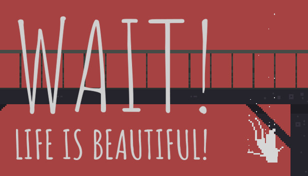
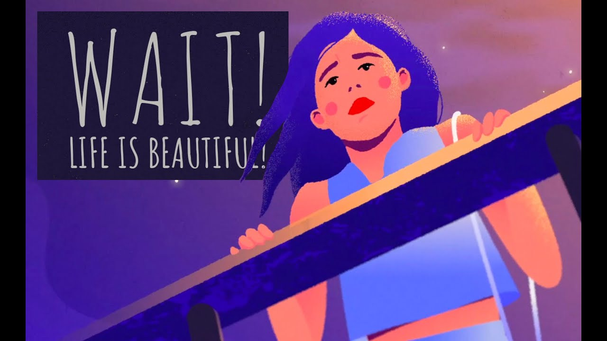

Amaan

**Website: [https://amaanigoose.github.io/](https://amaanigoose.github.io/)**

**Twitter: [https://twitter.com/amaanigoose](https://twitter.com/amaanigoose)**

**LinkedIn: [https://www.linkedin.com/in/amanullah-asad-07914018a/](https://www.linkedin.com/in/amanullah-asad-07914018a/)**

# Overview

Good news travels slowly, bad news has wings. In these uncertain times, tragedy often strikes fast and it strikes hard. The objective of the project is to design a virtual memorial where people can pay their respects to the dear departed on an hauntingly artistic website. Moreover people sharing similar trauma would be able to connect with each other and help in the process of healing. 

# Goals

1. Design a website that allows people to submit virtual condolences. 
2. Scale it up by adding forum for people to share their collective trauma. (Stretch goal)
3. Suicide-prevention site as a tie-in 

# Specifications

## Background and detailed explanation

To be honest, the idea for this came to me in a dream where an old school teacher of mine had died and a website was set up to honour her. That website was chillingly beautiful. You selected a flower, wrote a short message and dropped it into a vase via a nice animation. If you click on the vase, it will display the rest of the flowers and the messages attached to them along with the user who wrote it. 

## Technical skill sets invited

1. Development:
    1. Front End: ReactJs and Bootstrap 4.
    1. Backend: NodeJs and MongoDB
2. Design:
    2. Graphics: I need someone to make the vector art of the vase and the flowers.
    2. Overall design: I want someone with artistic vision to make the website look beautiful using a combination of colours and themes. 
3. Consultancy:
    3. Running quality checks and project vision adherence. 

# Milestones

1. UI design

    Creation of vector art and theme for the site

2. Front end development

    Implementing the designed UI

3. Backend Development

    Implementing the backend to store users and messages. Possibly including google validation to prevent abuse. 

4. Scaling up

	Implementing it so multiple condolences can run simultaneously. 
	Introducing people's shared trauma forum.

# Timeline

There are no hard and fast timelines but the project is supposed to start from the 4th week of October and be over by the last week of December. The stretch goals have no timelines attached.

# Contribution guidelines

Anyone who feels they share my artistic vision are welcome to contribute in any capacity they think is useful. 

# Resources

Vector art I am looking to take inspiration from:

